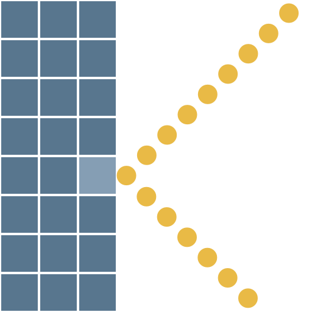

# Walls n Balls
A breakout-like game inspired by [Bricks n Balls](https://play.google.com/store/apps/details?id=com.peoplefun.bricksnballs)

### [Play on itch.io](https://kaasos.itch.io/walls-n-balls)

### Features
- Level editor
- Endless mode
- Supports mouse and touch controls
### To Do
- Improve `level_select.gd` to not load every single level into memory
- Add new levels
- Remake physics system (ideally with Jolt in Godot 4.4)
- Variable level width
### Credits
- Most of the art is from kenney.nl (CC0)
